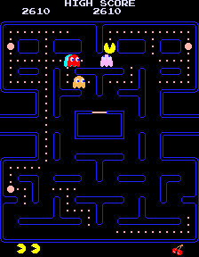
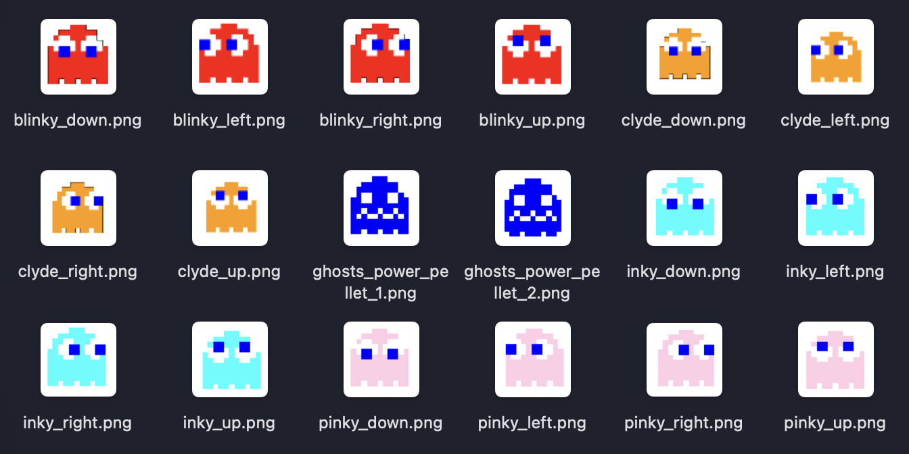
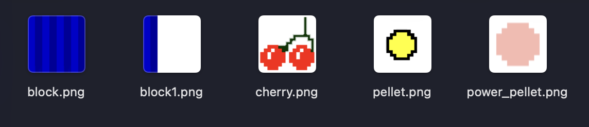
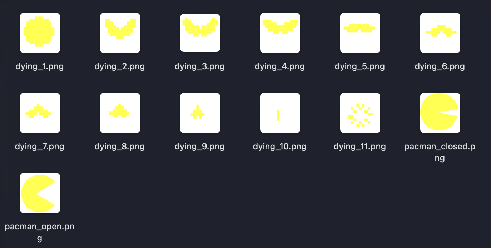

# Analiza funkcjonalna - Sieciowy PacMan

Piotr Suchy 310310

Podchodzę drugi raz do kursu `Zaawansowane C++`, w poprzednim roku również tworzyłem ten projekt, ale nie udało mi się go ukończyć na czas.

## Opis ogólny

Projekt zakłada stworzenie gry wzorowanej na klasycznym PacManie, z dodatkową funkcjonalnością rozgrywki wieloosobowej na tej samej planszy, zbierając punkty i unikając przeciwników. Dodatkowo, w grze pojawią się nowe efekty związane z różnymi typami power-upów. Zamierzam również zaimplementować dokładnie działające algorytmy poruszania się duchów, które wpłyną na zwiększenie trudności gry. Potencjalnie wykorzystam klasyczne algorytmy, lub zaimplementuję własne.

## Podstawowa funkcjonalność

Istnieją dwa tryby gry:

1. Tryb jednoosobowy
    - klasyczna rozgrywka na wzór PacMana
    - system punktacji
    - zbieranie kulek (pellets) i power-upów
    - interakcja ze ścianami i elementami planszy
2. Tryb wieloosobowy
    - możliwość stworzenia gry, do której dołączają inni gracze
    - dołączanie do istniejących gier jako gracz
    - synchronizacja stanu gry między graczami
    - współdzielona plansza, zasoby i punktacja

## Mechanika gry

1. Poruszanie się
    - sterowanie za pomocą strzałek
    - kolizje ze ścianami
    - płynny ruch w korytarzach
    - przechodzenie przez tunele

2. System punktacji
    - użytkownik otrzymuje punkty za zbieranie kulek (np. 10 pkt)
    - bonusowe punkty za power-pellets (wyróżniające się wyglądem), np. 50 pkt
    - tablica wyników dla wszystkich graczy
    - koniec gry w przypadku kolizji z duchem

3. “Power-upy”
    - czasowe wzmocnienia - “pożeranie” duchów + dodatkowe punkty podczas wzmocnienia
    - specjalne efekty wizualne
    - odporność na ‘kolizję’ z duchem
    - inny pomysł: przyspieszenie rozgrywki
    - inny pomysł: zmiana architektury mapy po zebraniu innego pelletu typu 'power-up'

## Komponenty główne

Główna logika gry będzie podzielona na warstwę logiki gry, warstwę sieciową i warstwę graficzną.

## Interfejs graficzny

Klasyczny interfejs graficzny PacMana:

Po wstępnej wyszukaniu Sprite'ów do gry, prawdopodobnie użyte zostaną:

\clearpage

## Zamysł na wykorzystanie wzorców i technik

Dziedziczenie i polimorfizm zostanie wykorzystany w hierarchicznej klasie Entity.
Szablony wykorzystane zostaną przy klasie `Grid<T>` do zarządzania planszą.
Wzorzec programistyczny singleton wykorzystany do klasy NetworkManager.
Reszta aplikacji wykorzystująca architekturę klient-serwer do obsługi wielu
graczy.

## Zachowane elementy PacMana

Chciałbym, żeby interfejs graficzny pozostał jak najbardziej zbliżony do klasycznego PacMana, ale sama rozgrywka będzie miała dodatkowe funkcjonalności, takie jak tryb wieloosobowy oraz nowe efekty związane z różnymi typami power-upów.

## Środowisko programistyczne

### Lokalnie

- MacOS - Sequoia 15.3
- Kompilator - AppleClang 16.0.0
- System budowania: CMake 3.10+
- Biblioteki
  - SFML (grafika i sieć)
  - STL (kontenery i algorytmy)

### Do sprawdzania części sieciowej

Maszyna wirtualna z Ubuntu 24.04 LTS hostowana na Linode jako serwer przetrzymujący stan danej rozgrywki. Połączenie się z dwóch różnych komputerów (jako klienci) do maszyny wirtualnej (serwer).
