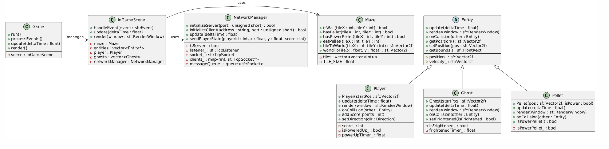

# Diagram klas i opisy – Sieciowy PacMan

Piotr Suchy 310310

## Opis klas

### Game

Główna klasa aplikacji, która zarządza cyklem gry (inicjalizacją, przetwarzaniem zdarzeń, aktualizacją stanu, renderowaniem). W tej wersji **Game** przechowuje bezpośrednio instancję **InGameScene**, dzięki czemu nie jest już konieczne zarządzanie wieloma scenami.

### InGameScene

Klasa reprezentująca tryb rozgrywki. Odpowiada za implementację logiki gry – obsługę zdarzeń (np. sterowanie za pomocą klawiatury), aktualizację stanu gry, renderowanie planszy oraz dynamicznych obiektów. W skład **InGameScene** wchodzą plansza (**Maze**), lista obiektów dynamicznych (entities), główny gracz (**Player**), duchy (**Ghost**) oraz komponent odpowiedzialny za synchronizację stanu gry w trybie wieloosobowym (**NetworkManager**).
Ta klasa scala logikę gry oraz część interfejsu użytkownika (renderowanie) za pomocą biblioteki SFML - Simple and Fast Multimedia Library.

### Maze

Klasa zarządzająca układem planszy gry. Przechowuje informacje o rozmieszczeniu ścian, pelletów i power-pelletów (kulki wzmacniające PacMana + dające dodatkowe punkty) w postaci dwuwymiarowej tablicy. Udostępnia metody sprawdzania, czy dany kafelek jest przeszkodą lub zawiera pellet, a także umożliwia konwersję współrzędnych między systemem logicznym (siatka), a systemem graficznym (piksele).
Klasa **Maze** pełni kluczową rolę w mechanice kolizji i interakcji gracza z elementami planszy.

### Entity (abstrakcja)

Bazowa klasa dla wszystkich dynamicznych obiektów w grze. Obiekt dynamiczny, to taki, którego stan może się zmienić albo poprzez ruch albo np. poprzez zjedzenie. Definiuje wspólne metody, takie jak aktualizacja stanu, renderowanie oraz obsługa kolizji, a także przechowuje podstawowe dane, jak pozycja i prędkość.
Klasy **Player**, **Ghost** oraz **Pellet** dziedziczą po **Entity**, co umożliwia spójne zarządzanie obiektami dynamicznymi.

#### Player

Reprezentuje gracza (Pac-Mana) w grze. Odpowiada za sterowanie, aktualizację stanu (np. punktacja, aktywacja power-upu po zjedzeniu power-pellet) oraz obsługę kolizji z innymi obiektami (np. zbieranie pelletów, interakcja z duchami).
Gracz kontroluje ruchy i zdobywa punkty poprzez zbieranie pelletów. Klasa posiada metody do zmiany kierunku ruchu oraz dodawania punktów.

#### Ghost

Reprezentuje przeciwników w grze (duchy). Zawiera logikę sztucznej inteligencji (do zaimplementowania...), która umożliwia śledzenie gracza, zmianę stanu (np. przejście w tryb przestraszenia) oraz interakcję z innymi obiektami.
Klasa **Ghost** odpowiada za dynamiczny ruch duchów oraz reagowanie na sytuacje, kiedy gracz zbiera power-pellet.

### Pellet

Odpowiada za kuleczki (pellety), które gracz zbiera, aby zdobywać punkty oraz zakończyć grę. Może występować jako zwykły pellet lub power-pellet, który dodatkowo aktywuje tryb wzmacniający u gracza.
Klasa **Pellet** implementuje logikę kolizji oraz odpowiada za zmianę stanu (np. usunięcie pelletu z planszy po jego zebraniu).

### NetworkManager

Singleton odpowiedzialny jest za synchronizację stanu gry w trybie wieloosobowym. Zarządza inicjalizacją serwera i klienta, przesyłaniem pakietów (pozycje graczy, stan punktacji, zbierane power-upy) oraz kolejkowaniem i buforowaniem wiadomości.
**NetworkManager** umożliwia komunikację TCP (UDP do przetestowania...) między graczami, co pozwala na wspólną rozgrywkę na jednej planszy.

## Podsumowanie

Przyjęta architektura systemu wyraźnie oddziela logikę gry od interfejsu użytkownika. Logika (obsługa planszy, ruch obiektów, kolizje, synchronizacja sieciowa) jest realizowana głównie przez klasy takie jak **InGameScene**, **Maze**, **Entity** (oraz jej pochodne) oraz **NetworkManager**. Interfejs użytkownika (renderowanie, obsługa zdarzeń) jest zaimplementowany poprzez metody render() i handleEvent(), korzystające z biblioteki SFML. Takie podejście ułatwia utrzymanie i rozwój aplikacji, zarówno w trybie jednoosobowym, jak i wieloosobowym.

## Porównanie z raportem z części pierwszej

W poprzedniej wersji analizy funkcjonalnej projekt zakładał zawiłą architekturę, obejmującą dwa tryby gry – jednoosobowy i wieloosobowy. W tym podejściu szczegółowo opisano mechanikę sterowania, kolizji, punktacji oraz synchronizacji stanu gry między graczami.

W nowej wersji przyjęto podejście uproszczone, które koncentruje się na kluczowych elementach systemu. Zamiast zarządzania wieloma scenami, cała rozgrywka jest obsługiwana przez pojedynczą klasę **InGameScene**. Pozostałe podstawowe komponenty, takie jak **Maze** (zarządzanie planszą), abstrakcyjna klasa **Entity** wraz z jej pochodnymi (**Player**, **Ghost**, **Pellet**) oraz **NetworkManager** (odpowiedzialny za synchronizację stanu gry w trybie wieloosobowym), pozostały bez zmian.

Takie uproszczenie sprawia, że cykl życia gry jest prostszy, a implementacja bardziej przejrzysta, przy zachowaniu pełnej funkcjonalności zarówno w trybie jednoosobowym, jak i wieloosobowym.

## Diagram klas

